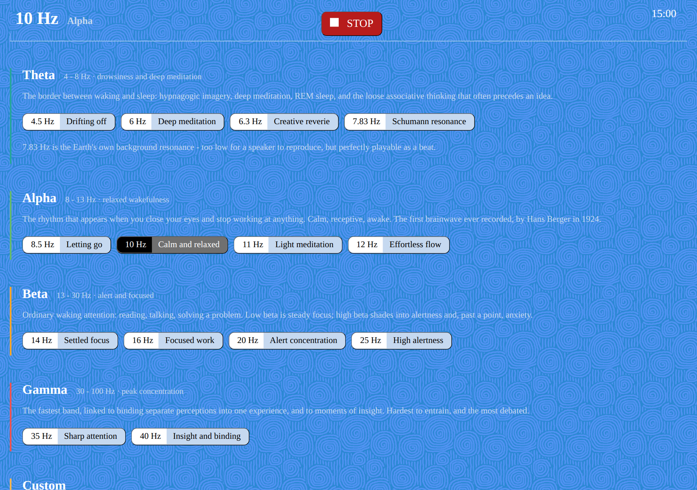
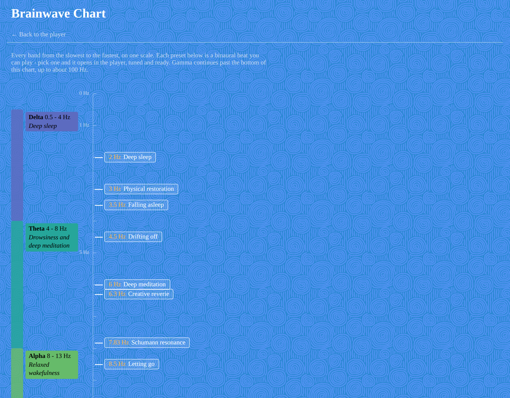

# Binaural-Beats

Simple web page to play binaural beats for sleep, meditation, relaxation, and focus: Delta, Theta, Alpha, Beta, and Gamma brainwave frequencies, with an optional pink or brown noise bed.

- [Play binaural beats](https://evoluteur.github.io/binaural-beats/)
- [See the brainwave chart](https://evoluteur.github.io/binaural-beats/brainwave-scale.html)

**Wear headphones.** A binaural beat is not in the sound, it is in the difference between your ears: one tone goes left, a slightly higher one goes right, and the pulse you hear is made by your own hearing. On speakers the two tones mix in the air and the effect is gone.

## Bands and presets

- **Delta** (0.5 - 4 Hz), deep sleep: 2 Hz, 3 Hz, 3.5 Hz.
- **Theta** (4 - 8 Hz), drowsiness and deep meditation: 4.5 Hz, 6 Hz, 6.3 Hz, 7.83 Hz.
- **Alpha** (8 - 13 Hz), relaxed wakefulness: 8.5 Hz, 10 Hz, 11 Hz, 12 Hz.
- **Beta** (13 - 30 Hz), alert and focused: 14 Hz, 16 Hz, 20 Hz, 25 Hz.
- **Gamma** (30 - 100 Hz), peak concentration: 35 Hz, 40 Hz.
- **Custom**: any beat from 0.5 to 40 Hz, on any carrier from 60 to 500 Hz.

7.83 Hz is the Schumann resonance, the Earth's own background frequency. It appears in [Healing Frequencies](https://github.com/evoluteur/healing-frequencies) as the one tone too low for a speaker to reproduce - here it is perfectly playable, because a beat has no pitch of its own.

## Controls

- **Beat** - the difference between your ears, and the band it falls in
- **Carrier** - the pitch you actually hear; the beat is easiest to perceive between 100 and 400 Hz
- **Session** - 5 minutes to an hour, with a countdown, a progress bar, and gentle fades in and out
- **Noise bed** - pink or brown noise underneath, with its own level
- **Volume** - master level for everything

While a session is playing, moving either slider glides the tones to the new setting instead of restarting them.

## How it works

Two sine oscillators are routed through a `ChannelMerger` rather than a panner, one per channel, so nothing of the left tone reaches the right ear - the beat only exists if the separation is exact. The beat is split around the carrier (a 10 Hz beat on a 200 Hz carrier plays 195 Hz and 205 Hz) so the perceived pitch stays put as you change the beat.

The noise bed is four seconds of pink or brown noise generated at load time and looped: pink through Paul Kellet's filter, brown through a leaky integrator.

Plain HTML, CSS, and JavaScript calling the Web Audio API, without external dependencies.

Binaural Beats is a Progressive Web App (PWA): you can install it on your phone or computer from the browser, and it works offline.

## About the effect

Heinrich Wilhelm Dove described it in 1839: two tones close in pitch, one per ear, and the brainstem reports a third pulse at their difference. The modern claim, called brainwave entrainment, is that sustained exposure nudges cortical rhythm toward that difference.

The honest summary of the research: studies most consistently report modest effects on anxiety, relaxation, and subjective sleep quality. Results for memory and attention are mixed, sample sizes are usually small, and it is hard to separate the beat from the simple act of sitting still with headphones on for twenty minutes. Treat it as a pleasant timer for doing nothing, and anything more is a bonus.

If you have epilepsy or a seizure disorder, are wearing a pacemaker, or are pregnant, ask a doctor before using brainwave entrainment. Do not listen while driving.

## License

Binaural Beats is Open Source at [GitHub](https://github.com/evoluteur/binaural-beats) with MIT license.

Encourage this project by [becoming a sponsor](https://github.com/sponsors/evoluteur).

You may also be interested in my other projects [Healing Frequencies](https://github.com/evoluteur/healing-frequencies), [Cymatics](https://github.com/evoluteur/cymatics), [Sacred Geometry](https://github.com/evoluteur/sacred-geometry), [Platonic Solids](https://github.com/evoluteur/platonic-solids), [Motivational Numerology](https://github.com/evoluteur/motivational-numerology), and [Archimedean Solids](https://github.com/evoluteur/archimedean-solids).

(c) 2026 [Olivier Giulieri](https://evoluteur.github.io/)
